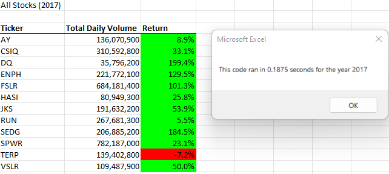
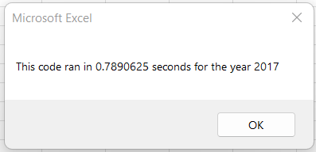

# An Analysis of Green Energy Stocks
Performs analysis on green energy stocks.
#### [green_stocks](./green_stocks.xlsm)

# VBA Stocks Challenge
#### [VBA_Challenge](./VBA_Challenge.xlsm)

## Overview of Project
Steve wants to expand the dataset to include the entire green energy stock market over the last few years 
to give his parents the best recommendation of which stocks to invest in.
Due to the large amount of data, it would take longer to execute the code. 
Reduce the time it takes to execute the code by refactoring the code to loop through all the data one time in VBA.

## Results

### Analysis of 2017 Green Energy Stocks

In 2017, all stocks, except for TERP, have a postive return. TERP has a negative return.
The stocks with the highest positive returns are DQ, ENPH, FSLR, and SEDG, 
all having a return percentage over 100% and DQ being the highest at 199.4% and SEDG being the second highest at 184.5%.
All stocks have a high total daily volume, with CSIQ, ENPH, FSLR, RUN, SEDG, and SPWR being the highest and having all over 200,000,000 shares.

The code ran in a short amount of time at 0.1875 seconds. The following image is the run time for the original VBA script on the stock data for 2017.
The refactored code run time is 0.6015625 seconds shorter than the original VBA script run time for 2017.

#### Original VBA Script 2017 Run Time

### Analysis of 2018 Green Energy Stocks

In 2018, only ENPH and RUN have postive returns, all other stocks have negative returns.
RUN has a higher return than ENPH at 84% and ENPH has a return of 81.9%.
ENPH and RUN both have high total daily volumes, 
with ENPH having higher total daily volume than RUN at 607,473,500 shares 
and RUN having a total daily volume of 502,757,100 shares.

The code ran in a short amount of time at 0.125 seconds. The following image is the run time for the original VBA script on the stock data for 2018.
The refactored code run time is 0.65625 seconds shorter than the original VBA script run time for 2018.

#### Original VBA Script 2018 Run Time

## Summary
The advantages of refactoring code is that it can make the run time for executing the code shorter. 
This makes getting results much quicker and makes the code more usable for the future in case more data is being analyzed later on.
This can also make the code more usable and shareable for other individuals or groups for their own datasets they need to analyze.

The disadvantages is the time it takes to conceptualize and build a refactored code that can achieve the results desired. 
Designing a refactored code takes time that needs to be taken into account when considering starting the process of refactoring code.
It would also take time to debug and refactor the code again when used for other purposes in the future or when used with other individuals or groups and their datasets.

The advantage of the refactored code is that it used a tickerIndex variable to keep track of the different stocks as it ran through the data in the worksheet,
therefore, it could run through the worksheet one time to analyze the stock data and is why there was a shorter run time.

The disadvantage of the original code is that it did not have a tickerIndex variable and only had a ticker variable to keep track of one stock each time the code ran through the data in the worksheet, therefore, it had to run through the worksheet one time for each of the different stocks being analyzed and, in this code, ran through the worksheet 12 times and is why there was a longer run time.

The advantage of the original code is that the VBA script is shorter and doesn't involve the time it takes to incorporate the tickerIndex variable.

The disadvantage of the refactored code is that the VBA script is a bit longer and involves the time it take to incorporate the tickerIndex variable, and overall, takes more time to build.
